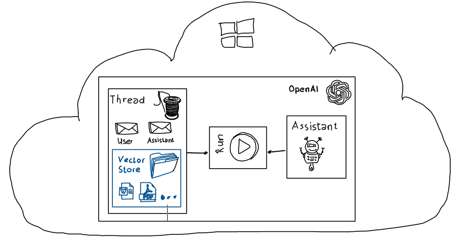

# OpenAI | Assistants API | File Search Tool 

## Overview

The OpenAI Assistants API File Search Tool is designed to empower assistants with the ability to access and retrieve information from ***uploaded files*** seamlessly without further preparation like embedding.

It augments the Assistant with knowledge from outside its model, such as proprietary product information or documents provided by your users. 

Multiple different document types like *.docx, *.pptx, *.txt, *.pdf, *.md etc. can be uploaded without  

Files can be easily uploaded and added to e.g. Threads, Assistants, or Runs. This allows for add-hoc and temporary provided information to a specific LLM completion.

## Repo Content

| File | Content | Details |
| ---- | ------- | ------- |
| [setup](./setup/setup.ipynb) | Polyglot note book to setup all necessary Azure resources to run the provided sample | Creates a resource group, an instance of Azure Open AI with a deployed gpt-4o model |
| [file_search_tool_ipynb](./src/file_search_tool.ipynb) | End-to-end sample which uploads two *.txt files with grounding information for an Assistants API run completion.  | Source code is provided in an easy to understand Polyglot note book with step-by-step guidance. A simple Run using the Azure OpenAI Assistants API is created where grounding information is provided within a Thread based on uploaded text files provided in a vector store. |
| [grounding_data](./assets/grounding_data/) | Grounding information for an Assistants API Run | Two files are provided. File one contains fictitious information about a restaurant in Berlin. The second file contains information about restaurant preferences for a specific person  |